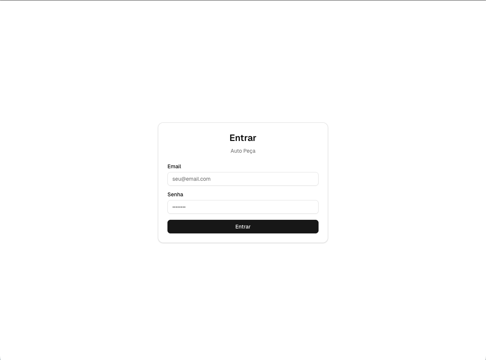

# Manual do Usuário - Sistema de Garantias por Etapas

Este manual explica como operar o sistema no dia a dia (balcão, interno, logística, cobrança e admin).

## Como usar este manual
- Se você esta comecando agora, leia as seções 1 a 4.
- Para o dia a dia, foque nas seções 5 a 11.
- Admin deve consultar a seção 12 sempre que houver ajustes.
- Para referência rápida: use `docs/CLIENTE_RAPIDO_1_PAGINA.md`.
- Para dúvidas comuns: use `docs/FAQ.md`.
- Ajuda rápida dentro do sistema: `/t/<tenant>/help`.

## Sumário
1. Visão geral do sistema
2. Acesso e navegação
3. Perfis de usuário (o que cada um pode fazer)
4. Dashboard (visão do dia)
5. Garantias (lista)
6. Abrir um ticket no balcão (NOVO)
7. Detalhe do ticket (tela principal de operação)
8. Como avançar a garantia por etapas (passo a passo)
9. Agenda (cobrança e proximas ações)
10. Timeline (histórico do ticket)
11. Anexos (documentos)
12. Admin (somente Administrador) — cadastros e configurações
13. Boas práticas e rotina recomendada
14. FAQ e solucao de problemas

# 1. Visão geral do sistema
- Para que serve: controlar garantias por etapas, com agenda de cobrança, anexos e histórico completo.
- Como a garantia anda: o ticket passa por etapas sequenciais (Recebimento -> Interno -> Logística -> Cobrança -> Resolução -> Encerrado).
- Conceitos principais:
  - Ticket: registro da garantia (cada caso tem um número).
  - Status/Etapas: fase atual do ticket.
  - Timeline/Registros: histórico de contatos e observações.
  - Agenda/Próxima ação: o que precisa ser feito e quando.
  - Anexos (Drive): arquivos do ticket (fotos, cupom, canhoto etc.).
  - Auditoria (Admin): rastreia mudanças e ações no sistema.

# 2. Acesso e navegação
## 2.1 Login
- Acesse o link do seu tenant (ex.: /t/seu-tenant/login).
- Informe email e senha e clique em "Entrar".
- Esqueceu a senha? Peça ao Admin para usar "Resetar Senha".

## 2.2 Menu principal
- Itens do menu:
  - Dashboard
  - Garantias
  - Agenda
  - Admin (somente Administrador)
- Desktop:
  - Menu lateral (sidebar) com os itens acima.
  - Topo com breadcrumb e menu do usuário (ação "Sair").
  - Se houver mais de uma loja, aparece o seletor "Selecionar loja".
- Mobile:
  - Navegação inferior (Dashboard, Garantias, Agenda e Admin quando permitido).
  - Topo mostra o título da tela e o menu do usuário.

# 3. Perfis de usuário (o que cada um pode fazer)

| Perfil | Criar ticket | Editar ticket | Avançar etapa | Anexar documentos | Registrar timeline | Definir próxima ação | Resolver/Encerrar | Voltar etapa | Acessar Admin |
| --- | --- | --- | --- | --- | --- | --- | --- | --- | --- |
| Recebedor | Sim | Sim (Cliente/Peça) | Não | Sim (exceto Canhoto) | Sim | Não | Não | Não | Não |
| Interno | Não | Sim (Peça e Loja/Fornecedor quando permitido) | Sim (Recebimento/Interno) | Não | Sim | Não | Não | Não | Não |
| Logística | Não | Não | Sim (Logística) | Sim (Canhoto) | Sim | Não | Não | Não | Não |
| Cobrança | Não | Não | Sim (Cobrança/Resolução) | Não | Sim | Sim | Sim | Não | Não |
| Administrador | Sim | Sim | Sim | Sim | Sim | Sim | Sim | Sim | Sim |

Observações:
- O botão "Editar" aparece somente para quem tem permissão.
- O botão "Voltar" aparece apenas para Administrador.
- O botão "Contato" na Agenda aparece apenas para Cobrança e Administrador.

# 4. Dashboard (visão do dia)
- Cards principais:
  - "Ações de Hoje"
  - "Atrasadas"
  - "Recebimento"
  - "Interno"
  - "Logística"
  - "Cobrança"
  - "Resolvidas (30d)"
- Clique em um card para abrir a lista correspondente.
- A lista "Ações de Hoje" e "Atrasadas" tem o botão "Ver todas".
- Indicadores:
  - "Atrasadas" mostra contagem em vermelho quando houver atrasos.

# 5. Garantias (lista)
## 5.1 Como pesquisar
- Campo "Buscar cliente, CPF/CNPJ, peça, venda..." serve para:
  - nome/razão social
  - CPF/CNPJ
  - celular
  - número da venda/CFe
  - codigo ou referência da peça

## 5.2 Como filtrar
- Filtros disponíveis:
  - "Status" (Todos Status ou um status especifico)
  - "Loja" (aparece apenas para quem não e Recebedor)
  - "SLA Estourado" (botão)
- Use "Limpar" para remover filtros.

## 5.3 Como abrir um ticket
- Desktop (tabela): clique na linha do ticket.
- Mobile (cards): toque no card do ticket.
- O ticket abre na tela de detalhe.

# 6. Abrir um ticket no balcão (NOVO)
Página: Garantias -> "Nova Garantia"

Passo a passo:
1) Seção "Cliente"
   - Nome / Razão Social *
   - Nome Fantasia / Apelido
   - CPF / CNPJ *
   - Celular *
   - WhatsApp (switch)
  - Campos opcionais: NF Ida, NF Retorno, Boleto c/ Abatimento, Remessa, Retorno
2) Seção "Peça"
   - Descrição da Peça *
   - Quantidade *
   - Referência
   - Codigo
   - Defeito *
   - Nº Venda / CFe *
   - Nº Venda/CFe Fornecedor
3) Seção "Datas e Logística"
   - Loja *
   - Data da Venda *
   - Data Recebendo Peça *
   - Data Indo Fornecedor
4) Seção "Observações"
   - Observações (opcional)
5) Seção "Anexos e Assinatura"
   - Assinatura do Cliente *: use "Salvar Assinatura" (ou "Limpar" para refazer).
   - Anexos: clique em "Selecionar Arquivos" e escolha a "Categoria" para cada arquivo.
6) Clique em "Criar Ticket".

O que acontece após salvar:
- O ticket e criado com status "Recebimento".
- Uma pasta e criada no Google Drive do tenant.
- A tela redireciona para o detalhe do ticket.

Se aparecer "Configuração Pendente":
- O Google Drive não esta configurado; solicite ao Admin configurar "ID da Pasta Raiz".

# 7. Detalhe do ticket (tela principal de operação)
## 7.1 Cabecalho
- Mostra "Ticket #XXXX", status, e badges:
  - "Atrasado" (quando ultrapassa o prazo)
  - "Ação pendente" (quando ha próxima ação)
- Ações disponíveis (conforme permissão):
  - "Editar"
  - "Avançar etapa"
  - "Registro"
  - "Anexar"
  - "Voltar" (Administrador)

## 7.2 Stepper de etapas
- Mostra as etapas: Recebimento, Interno, Logística, Cobrança, Resolução, Encerrado.
- Etapas concluidas podem ser clicadas para abrir "Resumo da etapa".
- O resumo mostra: Etapa, Data/Hora, Responsável, Última nota e Anexos.

## 7.3 Abas
- "Resumo": dados principais do ticket.
- "Timeline": histórico de registros.
- "Anexos": arquivos do ticket.
- "Auditoria": apenas para Administrador.

# 8. Como avançar a garantia por etapas (PASSO A PASSO)
Use o botão "Avançar etapa".

1) Recebimento -> Interno
   - Quem faz: Interno ou Administrador.
   - Requisitos: nenhum.
   - Resultado: status muda para "Interno".

2) Interno -> Logística
   - Quem faz: Interno ou Administrador.
   - Requisito: "Fornecedor definido".
   - Como resolver: usar o botão "Definir fornecedor".

3) Logística -> Cobrança
   - Quem faz: Logística ou Administrador.
   - Requisito: "Anexo CANHOTO".
   - Como resolver: clicar em "Anexar" e escolher a categoria "Canhoto".

4) Cobrança -> Resolução
   - Quem faz: Cobrança ou Administrador.
   - Requisito: "Resposta do fornecedor".
   - Como resolver: informar "Resposta do fornecedor" no diálogo de avançar etapa.

5) Resolução -> Encerrado
   - Quem faz: Cobrança ou Administrador.
   - Requisito: "Resultado final (Crédito/Troca/Negou)".
   - Como resolver: selecionar "Resultado" e, se necessario, preencher "Notas da resolução".

Observação opcional:
- Campo "Observação (vai para a timeline)" cria um registro automatico ao avançar.

# 9. Agenda (cobrança e próximas ações)
Página: "Agenda"

- Abas:
  - "Hoje"
  - "Atrasadas"
  - "7 Dias"
- Cada item mostra cliente, fornecedor e "Ação: dd/mm".
- Botão "Abrir" leva para o ticket.
- Para Cobrança e Administrador:
  - Botão "Contato" (ou ícone de telefone na tabela) abre "Marcar Contato Feito".
  - Preencha "Tipo de Contato" (Ligação/Email), "Notas do Contato", "Próxima Ação (Data)" e "Nota da Próxima Ação".
  - Clique em "Salvar Contato".
- Botão "Calendário":
  - Mostra o mês e os dias com contagem de ações.
  - Selecione um dia para ver a lista e use "Carregar mais" se aparecer.

# 10. Timeline (histórico do ticket)
- Abra a aba "Timeline".
- Clique em "Adicionar" (ou "Registro" no topo do ticket).
- Tipos de registro:
  - Observação
  - Ligação
  - Email
  - Prazo
  - Mudança de Status
  - Documento
- Quando marcar "Definir próxima ação", informe a data.
- O registro aparece com data/hora e usuário.

# 11. Anexos (documentos)
- Aba "Anexos" lista arquivos por categoria:
  - Fotos da Peça
  - Cupons Fiscais
  - Certificados de Garantia
  - Notas de Garantia
  - Canhotos
  - Outros
  - Assinaturas
- Clique no ícone de olho para visualizar.
- Clique no ícone de download para baixar.
- Dica: o "Canhoto" e obrigatorio para avançar para "Cobrança".

# 12. Admin (somente Administrador) — cadastros e configurações

## 12.1 Configurações do tenant (Drive e politicas)
- Aba "Configurações" -> "Google Drive":
  - Preencha "ID da Pasta Raiz".
  - Use "Testar Acesso ao Drive".
- Politicas:
  - "Recebedor ve somente tickets da propria loja"
  - "Exigir CANHOTO para avançar para cobrança"
  - "Permitir encerrar sem resolução"
  - "SLA Padrão (dias)"
- Clique em "Salvar Configurações".

## 12.2 Cadastrar Lojas
- Aba "Lojas" -> botão "Nova Loja".
- Campos: Nome, CNPJ, Endereco, Telefone.
- Ações: "Editar", "Ativar/Desativar".

## 12.3 Cadastrar Fornecedores
- Aba "Fornecedores" -> botão "Novo Fornecedor".
- Campos: Nome, CNPJ, Email, Telefone, SLA (dias).
- Ações: "Editar", "Ativar/Desativar".

## 12.4 Cadastrar Usuários
- Aba "Usuários" -> botão "Novo Usuário".
- Campos: Email, Senha, Nome, Papel, Loja Padrão.
- Ações: "Editar", "Resetar Senha", "Ativar/Desativar".

## 12.5 Auditoria
- Aba "Auditoria" -> filtros:
  - Data Início, Data Fim, ID do Ticket, Tipo
  - Botão "Buscar"
- Use para rastrear mudanças e ações.

## 12.6 Papeis
- Aba "Papéis" mostra a "Matriz de Permissões" (somente leitura).

# 13. Boas práticas e rotina recomendada
- Recebedor: abrir ticket completo, salvar assinatura e anexar documentos essenciais.
- Interno: definir fornecedor assim que possivel.
- Logística: anexar canhoto imediatamente após a entrega.
- Cobrança: trabalhar pela "Agenda" (Hoje/Atrasadas/7 Dias).
- Admin: manter lojas, fornecedores e usuários atualizados, e revisar "Auditoria".

# 14. FAQ e solucao de problemas
- "Não consigo avançar etapa"
  - Abra "Avançar etapa" e verifique a lista de "Requisitos".
- "Data da próxima ação aparece errada"
  - Revise a data na "Timeline" ou em "Marcar Contato Feito" e salve novamente.
- "Erro no Teste do Drive"
  - Verifique o "ID da Pasta Raiz" e compartilhe a pasta com a service account do Drive.
- "Não aparece Admin no menu"
  - O usuário precisa ter papel "Administrador".
- "Anexo não abre"
  - Tente "Baixar arquivo" e confirme se o ticket pertence ao mesmo tenant.
